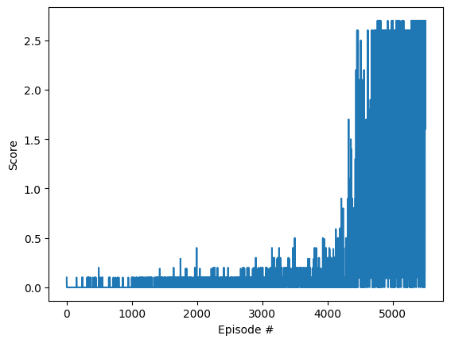

# Report

This report describes the Collaboration and Competition project for Udacity Deep Reinforcement Learning Nanodegree

## Learning algorithm

MADDPG algorithm was used to solve this enviroment. Each state, action, reward, next state and info if episode is done is stored in replay buffer, from which they are sampled to be used in the learning process. In learning process each critic takes in the states and actions from all agents then compares the expected values of rewards calculated with weigths from local critic neural network with values calculated for next step and next action chosen by target actor network with weights from target critic network. Next critic calculates loss for agent action.

## Hyperparameters

* num_steps = 5000 - number of steps with eps not min, approx 1500 steps per 100 episode in early stages
* LR_ACTOR = 1e-04 - actor learning rate
* LR_CRITIC = 1e-04 - critic learning rate
* TAU = 1e-01 - soft update parameter
* GAMMA = 0.99 - discount parameter
* BATCH_SIZE = 512 how many steps are batched in training the NN
* LEARN_EVERY = 20 - number of steps between learning
* LEARN_NUM = 10 - number of times the networks are optimized each learning step
* BUFFER_SIZE = int(1e6) - how many steps are stored in buffer
* EPSILON = 1 - starting epsilon value
* EPS_MIN = 1e-02 - minimal epsilon value
* EPS_DECAY = exp(log(EPS_MIN/EPSILON)/num_steps) - epsilon should hit eps_min after 5000 steps (num_steps variable)
* MU = 0. - OU Noise mu parameter
* THETA = .2 - OU Noise theta parameter
* SIGMA = .15 - OU Noise sigma parameter
* WEIGHT_DECAY = 0 - weight decay turned off

## Neural networks

In MADDPG two neural networks architectures are used, one for the actor and one for the critic of each of the agents. Actor neural network consists of two fully connected layers with 600 and 400 neurons with relu activation function and an output layer with 2 neurons with hiperbolic tangens activation function. Critic neural network consists of two fully connected layers with 600 and 400 neurons with relu activation function and an output layer with one neuron.

## Score plot

The enviroment was solved in 4403 episodes.

## Ideas for the future

In the future this project can be improved by using D4PG or adding Prioritezed Experiance Replay.